## 基于MFC与MATLAB混合编程的语音识别系统设计

### 目录

[TOC]

### 摘要

本系统以MFC上位机系统作为程序控制的中部枢纽，通过VC自带的MSComm控件与单片机进行单向通信，将采集到的数据在人机界面上显示，同时将数据保存到MATLAB的mat数据文件中。在离线工作模式下自动调用MATLAB函数对数据进行滤波以及时频空间上的转换，并将处理结果以绘图形式呈现。

   本文解决的问题主要是：

   1.PC与单片机通信

   2.MFC与调用matlab engine 进行混合编程

   3.matlab简单语音识别算法

没有解决的问题：

1. 语音识别的算法问题，在这里只是做一个简单的测试，并没对算法进行研究。

### 研究内容

本课题搭建的系统主要由三个部分构成：

1. 基于STC89C52单片机的语音采集系统；
2. 基于MFC Dialog的上位机系统；
3. 基于MATLAB m文件的语音数据处理算法。

其中单片机与MFC之间利用MSComm控件进行单向通信，即单片机采集到的数据单方向发送到MFC的缓存区。而MFC与MATLAB程序之间通过matlab engine进行函数的调用，从而实现混合编程。最终实现采集环境声音并在离线模式下进行数据处理显示的功能。

### 系统设计

#### 单片机程序结构

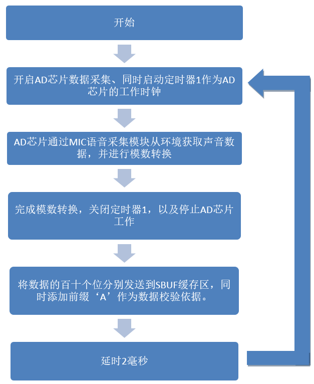

#### MFC上位机系统结构

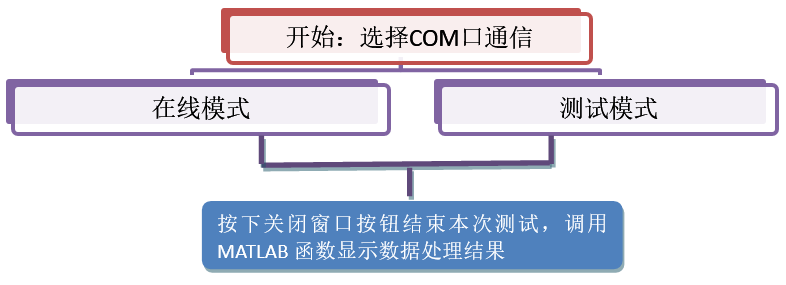

#### 在线模式下的程序结构

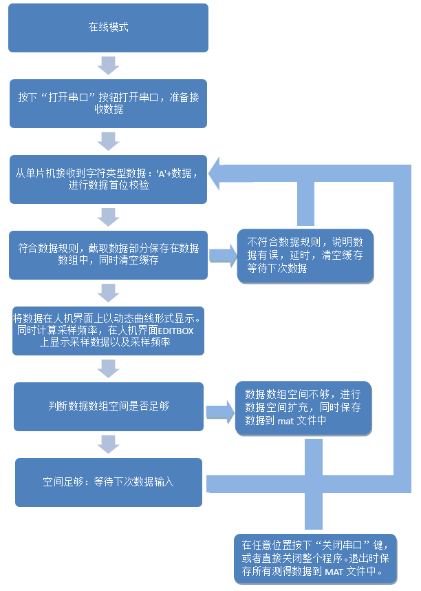

#### 测试模式下程序结构

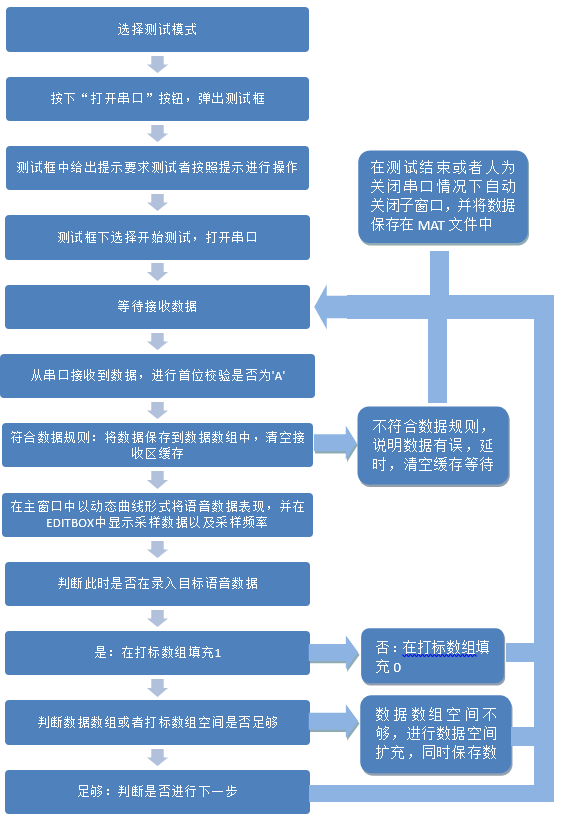

#### 测试模式下子窗口程序

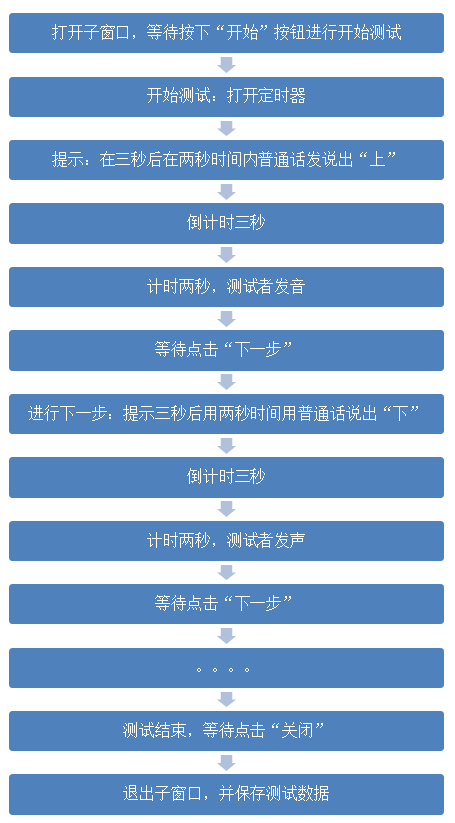

#### MATLAB数据处理结构

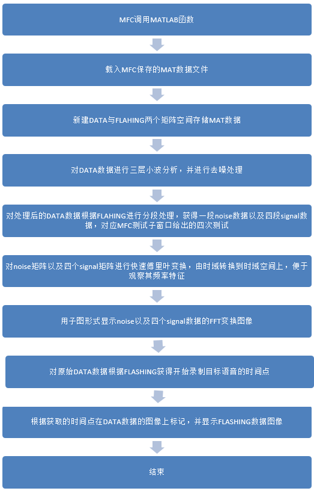

### 界面设计

#### 主界面

主界面设计简洁明了，便于操作。测试者可以通过串口选择不同的串口编号，不同的USB转串口线在PC上显示的串口编号有所差异，所以要根据实际需要选择。采样数据以及采样频率在编辑框中实时显示，并能够在绘图区动态绘制采样数据形成的曲线。

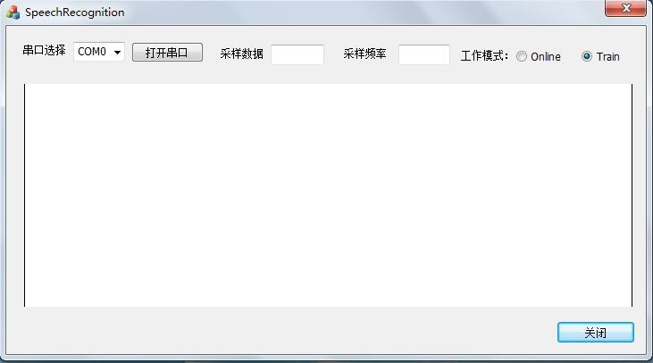

#### 测试模式下子窗口

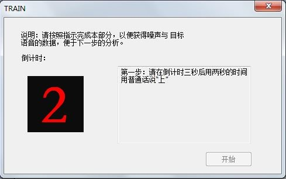

#### 主窗口绘制动态曲线

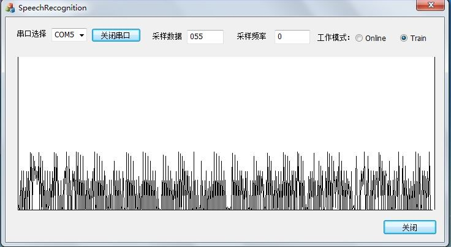

### 数据处理结果

在测试模式下采集完数据后，调用matlab函数对数据进行处理，结果如下所示，可以看出noise在频域上呈现均匀分布，而四个signal数据显示出语音在某段频率区间较强，而不同的目标声音之间也有差异。故可以利用这一特点区分不同的语音。

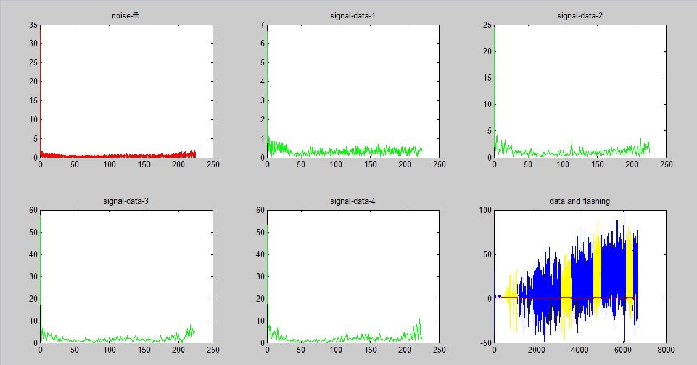

### 总结

#### 单片机程序部分

在这一部分主要考虑的问题是单片机如何采集环境数据并发送出去。由于设备有限，我们采用STC89C52单片机，以及ADC0809搭建语音采集的部分。但是由于ADC0809本身没有内部时钟，需要外部输入一定频率的脉冲作为时钟信号。考虑到设计基于555芯片的时钟电路会增加电路设计的难度，也会提高电路的复杂程度，故直接采用单片机自带时钟作为触发。而另外的，由于进行串口通信时所采用的波特率由单片机的定时器1模式所决定，也就是需要消耗另外一个定时器用于确定通信波特率。但由于单片机本身仅有两个定时器，这便导致了采样频率不能由我们确定，而是由定时器1同时决定。故我们只能通过MFC上位机计算单片机的采样率。

另外存在的问题是，由于语音采集模块本身固有的缺陷，导则了我们不能采集到负电位的数据，而且采集模块电容的存在导致放电时间延长，也就是采集到的数据不能很好的反映实际的语音信号，会出现很长的电压衰减过程。在这个方面上来说会对数据的分析造成很大的影响。

#### MFC程序设计部分

MFC程序使用Microsoft控件工具箱中的MSComm控件进行数据获取。MSComm控件在参数设定正确的情况下可以通过PC的串口接收来自其他设备的数据信息。当外界发送数据到接收缓冲区时，MSComm会受到触发，进入OnMSComm的处理函数中进行数据处理，但是在处理完数据之后必须要把接收区清空以免对接下来的数据造成影响。

MSComm控件也可以发送数据到发送缓冲区并通过串口将数据发送到外围设备，但是在本课题中，考虑到与单片机通过双工模式进行通信会大大延长每一帧的采样时间，也就是会降低系统的对语音的分辨率，对本来已经性能不好的采样设备造成很大影响，故最终使用单向数据传送。但如此难免会产生数据流发送的错位，因此需要MFC对数据进行单方面的校验。只有符合数据规则的数据才被接收，否则舍弃。但如此还是会出现数据错位的情况。

在MFC使用MSComm控件主要出现的问题是，MSComm控件使用的环境设置问题。一开始不知道如何调用该控件，故经常出现类似于“不能识别的符号”等问题，也会出现没有lib文件，但是在进行相应的设置之后还是会出现“断言错误”等严重的错误。最后在多次尝试之后发现是与系统不兼容。Microsoft所带的MSComm控件是在32位的windows平台下才能够使用，暂时也没有找到64位平台下的MSComm控件，故只能把visualstudio的x64平台改回win32的平台，在这样的情况下才能够正常使用MSComm控件。然而这个与6位matlab程序冲突。这个问题在接下来的摸索中解决了。

关于MSComm控件的调用需要注意的是，在visual studio软件平台中并没有这个控件，故需要人工导入。导入的流程如下：打开visualstudio 2010b->Tools->Choose Toolbox Items->COM Components->选择 Microsoft Communications Control, version 6.0即可以将MSComm控件加入到控件工具箱中使用。然后利用Class Warze创建一个MSComm类。理论上则可以使用该控件进行串口通信了，但是实际上创建的MSComm类中的cpp文件是空的，很多函数都缺失了，故仍需要从网上下载相关的cpp文件。

### MFC与MATLAB混合编程

#### 基于MATLAB engine的混合编程

使用matlab混合编程时，由于是使用engine调用函数在matlab java虚拟机的环境下编程，理论上可以实现matlab所有的功能。但由于没有完全脱离matlab平台，故在运行方面仍是比较麻烦，需要的内存也比较大。

Visual studio 在使用其他软件的函数时通常都要进行相关的环境设置。在使用MATLAB engine进行混合编程时，需要将matlab需要的头文件以及库文件等添加到visual studio的搜寻路径中。通常设置如下：在Class View 的界面下对建立的工程点击右键，选择properties，出现如下界面：

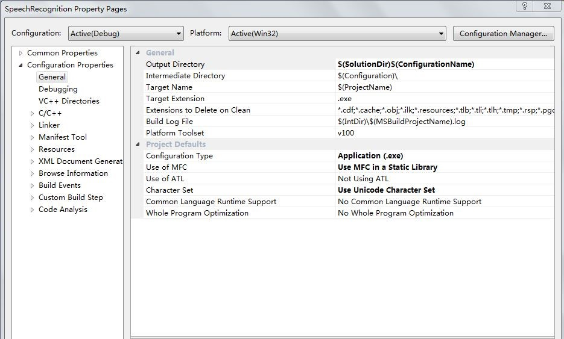

在VC++ Directies中添加library以及include的搜寻路径，在linker中添加所需要的lib文件名称。这样便可解决调用matlab engine过程中出现的大部分“不能识别符号”的错误了。

但仍需要注意的是，在安装的matlab\extern\include或者matlab\extern\lib文件夹中并没有所有的需要的文件，大部分的lib,dll文件默认保存在matlab\bin的目录下，故需要把文件拷贝到include目录下，才能正常使用。

在解决完这一切之后，会出现的问题是前文提到的版本兼容问题。由于一开始安装的matlab是64位的，故只能是在visualstudio的x64编译平台下使用，在win32下使用常会出现严重的“断言错误”，导致程序不能正常运行。故在查阅了大量网络资料发现这个问题之后，把原来win32的平台改成x64的平台，从而可以正常使用64位的matlab。但在接下来使用MSComm的时候不得已又因为兼容问题把x64改回win32，并且将matlab重新安装成32位。故实现了同时使用MSComm控件和matlab engine.

此外面临的问题是，visual studio的环境中会出现不能正常使用用户自己编的函数的问题。在多次尝试之后发现，需要将用户自编的函数添加到matlab的搜寻路径中才能够正常使用。需要注意的问题是，使用matlab engine并不会运行matlab软件平台，而是运行matlab的java虚拟机以节省运行所需要的内存。也就是需要在虚拟机中将函数所在文件路径添加到搜寻路径中，而不是在软件平台下添加。在处理完这个问题之后基本是可以进行混合编程了。

#### 基于com组件的混合编程

Matlab平台带有的编译器可以编译产生com组件，也就是可以将matlab函数所需要用的函数都打包成动态链接库的形式，并将用户自编的函数编译成cpp文件。在理论在，com组件可以在任何平台下使用。

最初打算使用com组件进行混合编程，但是由于版本问题，matlab所带的部分dll文件仍为64位系统使用，不能在32位的情况下使用，导致了com组件的产生失败。而通过命令语句的形式调用matlab MCC编译器产生cpp文件最后都因为缺少必要的dll文件而不能顺利使用。在这个问题没有解决的情况下最终决定使用matlabengine进行混合编程。

